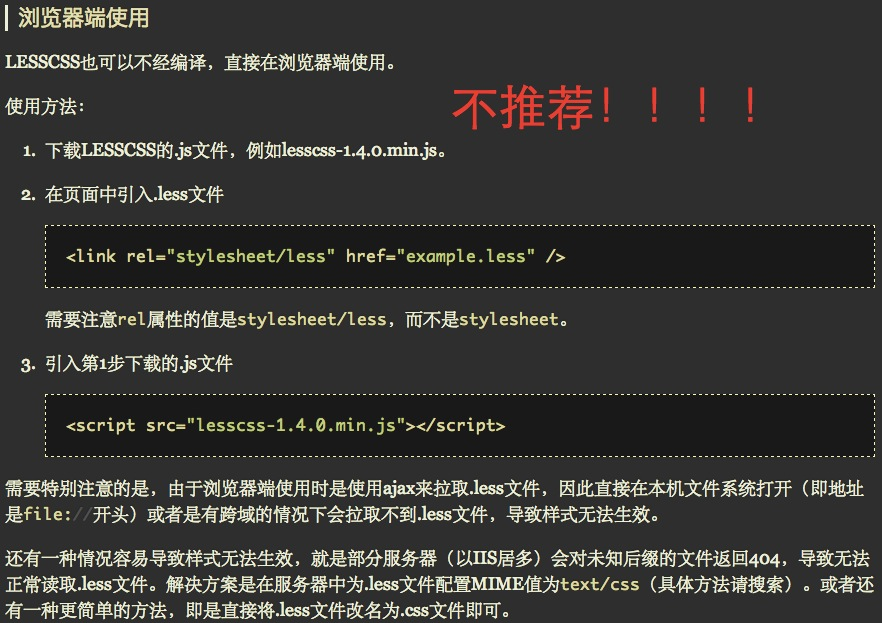

＃LESS最初使用篇（配图讲解）

写这篇讲解的缘由是想帮助一开始接触less,不知道怎么使用less的童鞋，这里只讲解最简单的使用方法，至于那些啥么sublime less2css, grunt-less编译工具等等，这里不讲解, 这里只用koala。初学者建议先使用koala，之后再用其他工具。好吧，以下是简单且快捷的使用方法：

###了解，学习。LESS中国官网: [http://www.lesscss.net](http://www.lesscss.net)

刚开始接触LESS,总要先去官网学习和了解LESS吧，不然去群里边问，别人跟你讲解你也觉得模糊。千万记得，自己要动手试试！哈哈哈.......

＃＃＃不推荐浏览器端的使用方法！！！！



你用less浏览器端的使用方法了吗？用了！好吧，建议你换其他的编译方法，或是使用第三方编译工具。

至于为什么不推荐，官方的说法是：

> 在客户端使用 Less.js 是最容易的方式，并且在开发阶段很方便，但是，在生产环境中，性能和可靠性非常重要，我们建议最好使用 node.js 或其它第三方工具进行预编译。

###本文重点：用koala编译less文件，在页面中引入编译好的css文件（ps:亲，koala可以实时编译哦！）

>首先下载[koala](http://koala-app.com/index-zh.html)
> > 然后安装。。。。。

```html
test/
├── styles/
│   ├── useLess.less
└── index.html
```

koala变异后：

```html
test/
├── styles/
│   ├── useLess.less
│    ├── useLess.css
└── index.html
```
> 将项目中的Styles文件夹移到koala中,
> > 在koala中选上自动编译和压缩方式,
> > > 之后在编辑器中编写less，然后保存,
> > > > 你就会发现项目的样式文件夹中多了个.css文件，然后将.css文件引入到页面中（这个可以一开始就在页面中引入.css文件），继续编写less。

```html
<!doctype html>
<html lang="en">
<head>
	<meta charset="UTF-8">
	<title>less</title>
	<link rel="stylesheet" href="css/useless.css">
</head>
<body>
	<a href="http://www.lesscss.net">我喜欢的颜色是红色</a>
</body>
</html>
```

```css
@fontColor: white;
@bgColor: red;

body {
	background: @bgColor;
}
a {
	color : @fontColor;
	&:hover {
		text-decoration:none;
    }
}
```

koala编译后

```css
body {
  background: #ff0000;
}
a {
  color: #ffffff;
}
a:hover {
  text-decoration: none;
}
```

还是不明白我在说什么是吗。。。看图！


NOTE:如果想设置话，在koala的那个齿轮里边设置语言，压缩方式等等，自己随便点下就懂了，哈哈哈哈。。。

好了，看完这里之后，可以去LESS中国官网: [http://www.lesscss.net](http://www.lesscss.net)看教程了，跟着里面边练边学，如果之后自己不想用koala编译，再去折腾折腾其他的编译方式，完全取决于自己的兴趣和习惯，哈哈哈哈哈。。。。。

如果文中有什么不对的地方，欢迎各位大神的知道，偶只是一名前端菜鸟！哈哈哈哈。。。。。。

